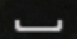

# Vision Reflex Kit

A small **computer-vision reflex module** for fast UI prompt detection. It analyzes
screen regions and emits structured **signals** (`timing_prompt_a`, `timing_prompt_b`)
intended for a higher-level decision / planning layer.

This repository contains **detection and documentation only**. The public tree does not
ship keyboard/mouse automation or game control loops.

## ⚠️ Legal Disclaimer & Warning

**For Educational Purposes Only**  
This repository and any related automation script(s) are created strictly for educational, research, and proof-of-concept purposes.

**Risk of Account Ban**  
Using automation scripts, macros, or bots may strictly violate the End User License Agreement (EULA) and Terms of Service (ToS) of AC4 and its publisher. By using this script, you acknowledge that you are doing so at your own risk. The use of this software may result in severe consequences, including but not limited to, temporary suspensions or permanent bans of your account.

**No Affiliation**  
This project is independent and is not affiliated with, maintained by, authorized by, endorsed by, or in any way officially connected with the developers or publishers of AC4 (e.g., Ubisoft) or any of their affiliates. All product and company names are the registered trademarks of their original owners.

**Provided "As Is"**  
This software is provided "as is," without warranty of any kind, express or implied. The developers, contributors, and maintainers of this repository assume zero responsibility or liability for any damages, account penalties, or losses that may arise from downloading, compiling, or using this script. You are solely responsible for your own actions.

## What this repo includes

| Path | Purpose |
|------|---------|
| [`reflex/`](reflex/) | Color-blob + template-match detectors, `ReflexEngine` |
| [`examples/demo_on_samples.py`](examples/demo_on_samples.py) | Run detection on bundled PNGs |
| [`examples/live_signal_preview.py`](examples/live_signal_preview.py) | Live region capture → print signals (no inputs) |
| [`assets/samples/`](assets/samples/) | Example screenshots + UI chip template (see below) |
| [`docs/APPROACHES.md`](docs/APPROACHES.md) | Design notes, tuning, architecture |

## Sample assets (`assets/samples/`)

Bundled PNGs for `examples/demo_on_samples.py`. Full notes: [`assets/samples/README.md`](assets/samples/README.md).

| File | Role |
|------|------|
| [`combat_scene.png`](assets/samples/combat_scene.png) | Full combat frame — color-blob + template tests |
| [`break_defence_scene.png`](assets/samples/break_defence_scene.png) | Frame with HUD key / break-style prompt |
| [`ui_chip_template.png`](assets/samples/ui_chip_template.png) | Cropped UI chip for `cv2.matchTemplate` |

**Combat scene** (timing indicators in frame):


**Break-defence style prompt** (template-match target context):


**UI chip template** (crop used for multi-scale matching):



## Architecture (fits a larger agent)

```text
┌─────────────┐     ┌──────────────────┐     ┌─────────────────┐
│ Screen grab │ ──► │ ReflexEngine     │ ──► │ Your planner /  │
│ (mss region)│     │ .analyze(frame)  │     │ policy layer    │
└─────────────┘     └──────────────────┘     └─────────────────┘
                            │
                            ▼
                     FrameAnalysis
                     - primary: ReflexKind
                     - hits + confidence
                     - metrics (red_pixels, template score)
```

The reflex layer answers: **“Did a time-sensitive UI prompt appear?”**  
Your agent decides: **“What action is allowed in this context?”**

## Quick start

```bash
pip install -r requirements.txt
python examples/demo_on_samples.py
```

Expected output: per-image signal summary (blob / template scores).

### Live preview (signals only)

```bash
python examples/live_signal_preview.py
```

Edit `CAPTURE_REGION` in that file for your monitor layout. **No keys or mouse events
are sent.**

## Detection approaches (summary)

1. **Color blob (Prompt A)** — `cv2.inRange` on a target BGR color, then contour area
   filter to reject scattered noise. Good for saturated, unique UI dots.

2. **Template match (Prompt B)** — `cv2.matchTemplate` with multi-scale search
   (75%–125%). Good for grayscale HUD chips; tune `threshold` (~0.62–0.70).

See [`docs/APPROACHES.md`](docs/APPROACHES.md) for timing trade-offs, false positives,
and capture-region tuning.

## Configuration

```python
from pathlib import Path
from reflex import ReflexEngine, ColorBlobConfig, TemplateMatchConfig

engine = ReflexEngine(
    color_cfg=ColorBlobConfig(tolerance=35),
    template_cfg=TemplateMatchConfig(threshold=0.65),
    template_path=Path("assets/samples/ui_chip_template.png"),
    enable_template=True,
)

result = engine.analyze(frame_bgr)  # numpy BGR image
print(result.primary, result.metrics)
```


## License

MIT — see [LICENSE](LICENSE). Sample screenshots are provided for demonstration;
replace with your own captures for production use.
